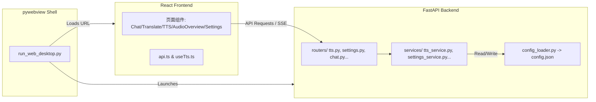

# VoiceSpirit 2.0 Web 桌面客户端开发与维护指南

为了提升开发效率、改善 UI/UX 体验以及支持未来的云端/SaaS 化部署，VoiceSpirit 2.0 已完成从 PySide6 客户端向 **Web 桌面客户端（FastAPI 后端 + React 前端 + pywebview/Electron 桌面外壳）** 的完全转型。

> [!IMPORTANT]
> 所有原有 PySide6 代码（`app/` 核心逻辑、`utils/` 播放器与 Qt TTS 处理、`main_new.py` 入口等）已全部移至 **`archive_pyside6/`** 目录进行封存归档。
> **请勿在 `archive_pyside6/`、`app/` 或 `utils/` 目录下进行任何开发与代码修改**。后续所有的功能开发与维护，必须且仅专注于 `backend/`、`frontend/` 及桌面外壳脚本。

---

## 1. 架构设计与技术栈

### 1.1 系统架构图



### 1.2 核心模块分层

1. **React 前端 (`frontend/src/`)**：
   * **入口**：`frontend/src/main.tsx`。
   * **API 封装**：`frontend/src/api.ts`（支持 API 请求定义、音频 file Blob 解析、SSE 流式解析等）。
   * **Hooks**：`frontend/src/hooks/useTts.ts`（处理 TTS 配置与状态）、`frontend/src/hooks/useSettings.ts`（处理设置）。
   * **页面 Tab**：`frontend/src/pages/`（含 `TtsPage.tsx`, `SettingsPage.tsx`, `ChatPage.tsx` 等）。
2. **FastAPI 后端 (`backend/`)**：
   * **入口**：`backend/main.py`。
   * **路由控制层**：`backend/routers/`（接受 HTTP 请求，进行参数验证与格式化错误响应）。
   * **业务服务层**：`backend/services/`（实现业务核心逻辑）。
     * `settings_service.py`：读写 `config.json` 的首选服务类。
     * `tts_service.py`：封装了 Edge TTS、OpenAI TTS、ElevenLabs TTS、MiniMax TTS 以及小米 TTS，包含音色获取、音频合并与异步处理。
     * `config_loader.py`：低级别的 API Key/URL 解析器，供其他服务调用。
3. **桌面外壳 (`run_web_desktop.py`)**：
   * 基于 `pywebview` 运行，负责本地拉起 FastAPI 后端进程、进行后台探活，并在专用窗口中渲染 React 构建好的静态 SPA 页面（访问 `http://127.0.0.1:8000/app`）。
   * 提供系统级菜单、应用退出与生命周期绑定。

---

## 2. 快速启动与日常开发

### 2.1 依赖安装 (首次运行)
确保您安装了 Python 3.10+ 和 Node.js。

```bash
# 1. 安装后端依赖
cd backend
pip install -r requirements.txt

# 2. 安装前端依赖
cd ../frontend
npm install
```

### 2.2 本地联合调试 (热更新开发模式)
在开发新功能或调试 UI 时，分别启动前端和后端：

```bash
# 终端 1: 启动 FastAPI 后端 (监听 http://127.0.0.1:8000)
cd backend
python main.py

# 终端 2: 启动 React 开发服务器 (监听 http://localhost:5173，支持保存自动刷新)
cd ../frontend
npm run dev
```
开发时，可直接在浏览器中访问 `http://localhost:5173` 进行全功能调试与联调。

### 2.3 桌面端一键运行
直接双击运行根目录下的批处理脚本：
* **`run_web_desktop.bat`**：自动编译 React 前端，然后拉起 Python 外壳并运行本地桌面客户端窗口。

---

## 3. 测试与验证指南

### 3.1 运行后端单元测试
在每次修改后端代码（尤其是在 `backend/services/` 或 `backend/routers/`）后，必须运行以下测试套件以避免功能回归。由于后端代码包含自定义模块引用，运行测试时需要设置 `PYTHONPATH` 环境变量指向 `backend` 目录，并使用 Windows 虚拟环境中的 Python：

```bash
# PowerShell 下运行后端单元测试
$env:PYTHONPATH="backend"; & "./venv/Scripts/python.exe" -m unittest discover -s backend/tests -p "test_*.py" -v

# Git Bash 或 CMD/Bash 下运行后端单元测试 (Windows 环境)
set PYTHONPATH=backend
./venv/Scripts/python -m unittest discover -s backend/tests -p "test_*.py" -v
```

### 3.2 编译与代码格式校验
提交或发布前，确保没有语法错误和打包阻碍：

```bash
# 1. 检查后端 Python 编译
& "./venv/Scripts/python.exe" -m py_compile backend/services/*.py backend/routers/*.py

# 2. 检查前端 React 打包编译
npm --prefix frontend run build
```

---

## 4. 后续功能开发规范

### 4.1 新增一个 TTS 服务商的开发流程
如果您需要接入新的 TTS 服务商（例如 微软 Azure TTS / 阿里 CosyVoice 自建 API）：
1. **更新后端配置模板**：
   * 在 `backend/services/settings_service.py` 的 `DEFAULT_SETTINGS_TEMPLATE` 中追加对应的 API Key、URL 和默认 Model 键。
   * 在 `backend/services/config_loader.py` 的 `PROVIDER_KEY_MAP` 和 `DEFAULT_BASE_URLS` 中添加映射。
2. **编写生成代码**：
   * 在 `backend/services/tts_service.py` 中，定义服务商的引擎常量（如 `TTS_ENGINE_AZURE = "azure"`）并加入 `SUPPORTED_TTS_ENGINES`。
   * 在 `TTSService` 中编写 `_generate_azure_audio` 方法。
   * 更新 `detect_engine_by_voice`、`generate_audio` 和 `list_voices`，以支持 Azure 的音色查询和音频 file 生成。
3. **前端适配**：
   * 在 `frontend/src/api.ts` 的 `TtsEngine` 类型中加入新的引擎名称。
   * 在 `frontend/src/hooks/useTts.ts` 的 `engineOptions` 中加入新选项和用户提示语。
   * 在 `frontend/src/pages/SettingsPage.tsx` 的 `getProviderDisplayNames` 中增加其中英文显示名称。
4. **验证与交付**：
   * 保存设置，使用合成页面进行测试，确认 file 生成在 `backend/temp_audio/` 下且预览和下载功能一切正常。
